# E-Banking Backend Application

A Spring Boot-based backend system for e-banking operations, supporting customer management, current and savings bank accounts, and transactional account operations (debit, credit, and transfers) with pagination and global exception handling.

---

## Authors & Supervision
- **Author:** Hamza Benbrahim
- **Supervised by:** Professeur Mohamed YOUSSFI

---

## Technical Stack
- **Backend Framework:** Spring Boot 4.1.0 (Java 21)
- **Data Persistence:** Spring Data JPA with MySQL Database
- **API Documentation:** Springdoc OpenAPI / Swagger UI
- **Mappers & Utilities:** MapStruct 1.5.5.Final, Lombok
- **Infrastructure:** Docker (MySQL & phpMyAdmin)
- **API Testing:** Postman

---

## Project Structure & Architecture

### 1. Infrastructure (Docker Setup)
The application utilizes Docker to spin up the required database and database administration environments.
- **MySQL Database:** Exposes database services on port `3306`.
- **phpMyAdmin:** Exposes web database interface on port `8090`.

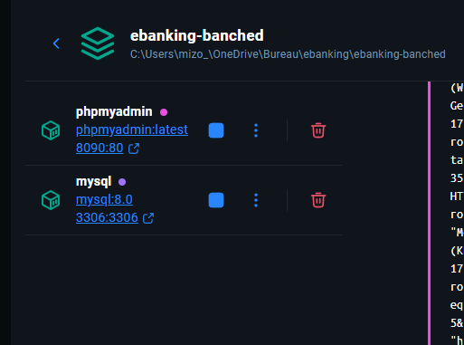

---

### 2. Database Structure (phpMyAdmin)
Hibernate ORM is configured to automatically create the schema in the `ebanking_db` database. 

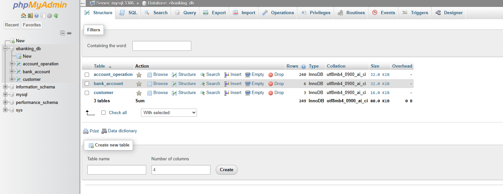

The schema comprises three core tables:
- **`customer`**: Stores customer profiles (ID, name, and email).
  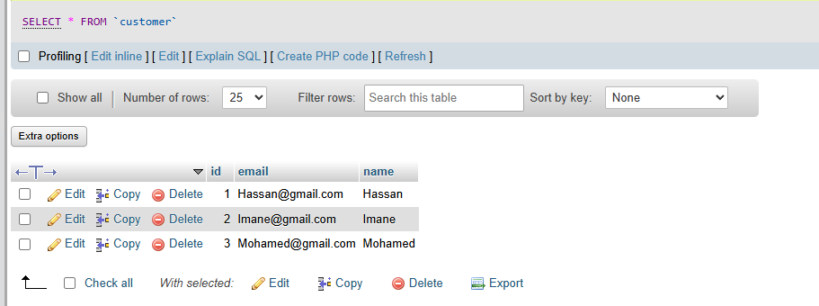

- **`bank_account`**: Stores current accounts (with `overDraft` limits) and savings accounts (with `interestRate`s) using a single-table inheritance strategy.
  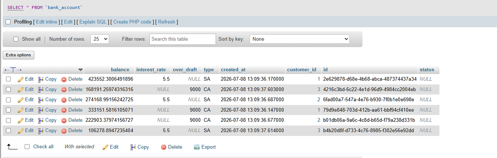

- **`account_operation`**: Logs all credit and debit transactions, linked to their respective bank accounts.
  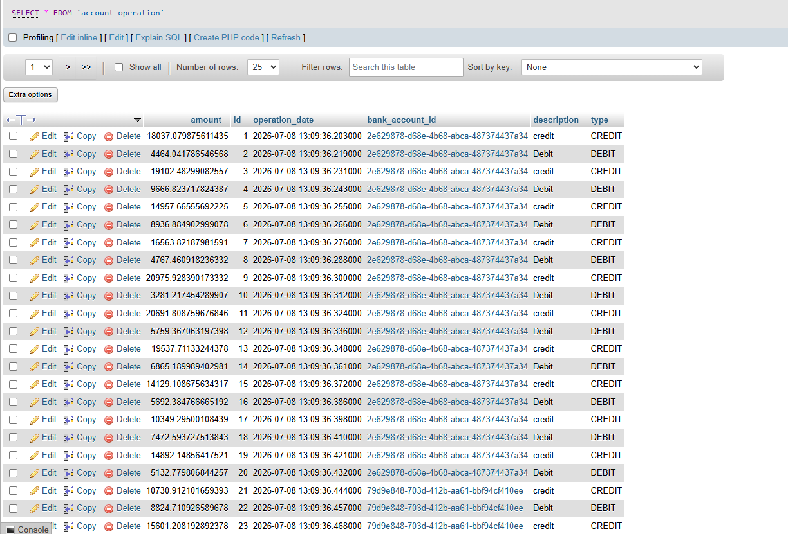

---

## API Testing & Verification

Below are the Postman testing results for the REST Controller endpoints.

### 1. Customer CRUD Operations (`CustomerRestController`)

#### Retrieve All Customers (`GET /customers`)
Fetches the list of all registered customers.
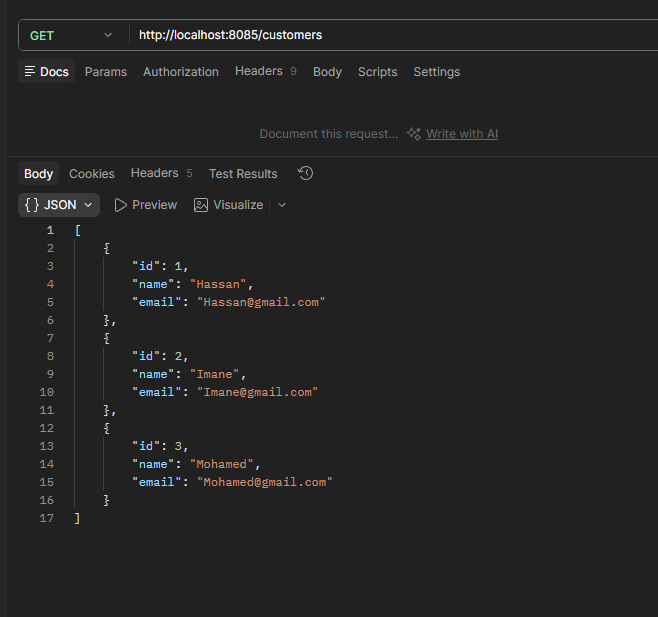

#### Create a New Customer (`POST /customers`)
Adds a new customer profile.
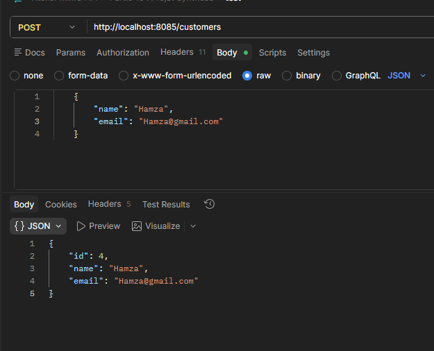

#### Fetch Customer Details by ID (`GET /customers/{id}`)
Fetches specific customer details by ID.
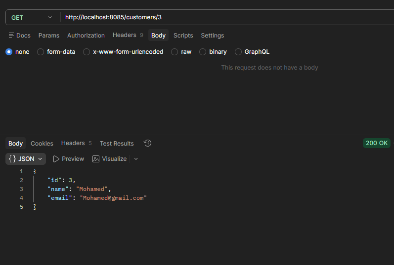

#### Update Customer Details (`PUT /customers/{customerId}`)
Updates the customer record.
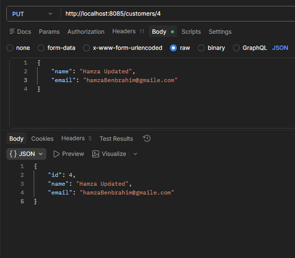

#### Delete a Customer (`DELETE /customers/{customerId}`)
Deletes the customer record by ID.
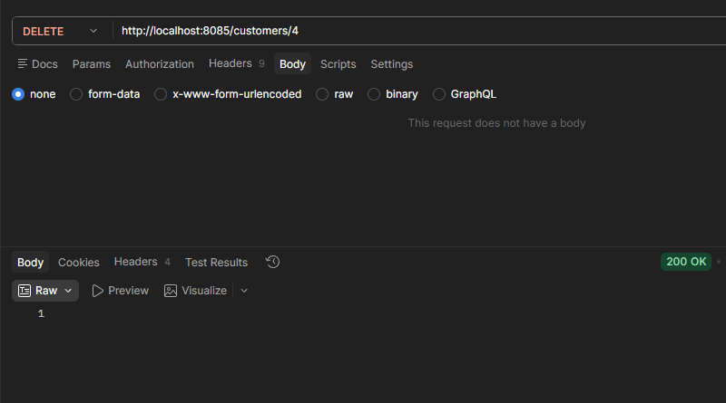

---

### 2. Bank Account Operations (`BankAccountRestController`)

#### Retrieve All Bank Accounts (`GET /accounts`)
Fetches the list of all registered current and savings bank accounts.
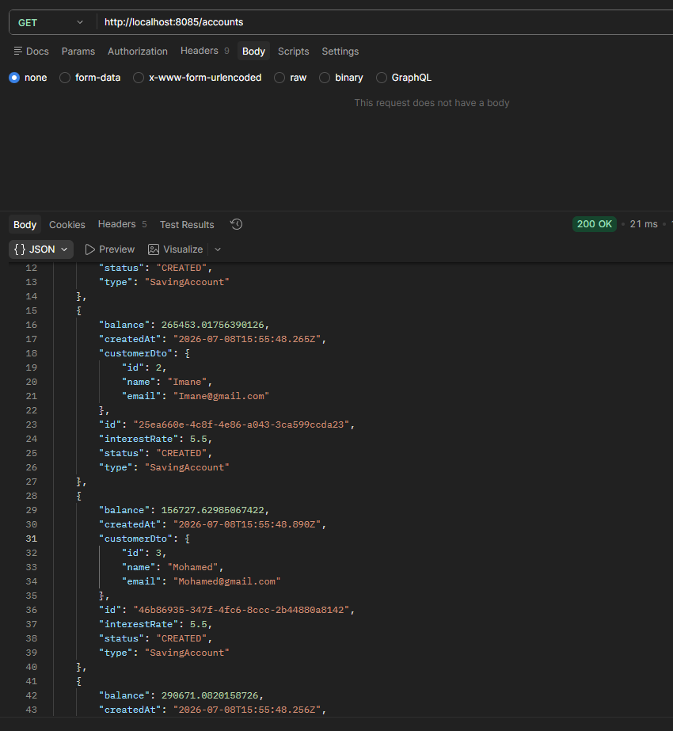

#### Fetch Bank Account Details by ID (`GET /accounts/{accountId}`)
Fetches details of a specific bank account.
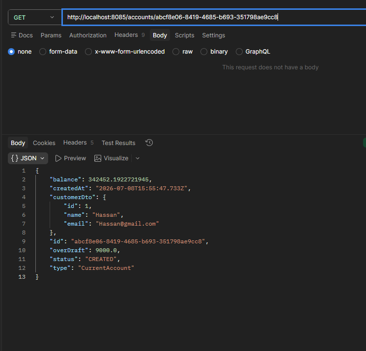

---

### 3. Transactional Operations & History (`OperationRestController`)

#### Account Debit (`POST /accounts/debit`)
Debits a specified amount from an account.
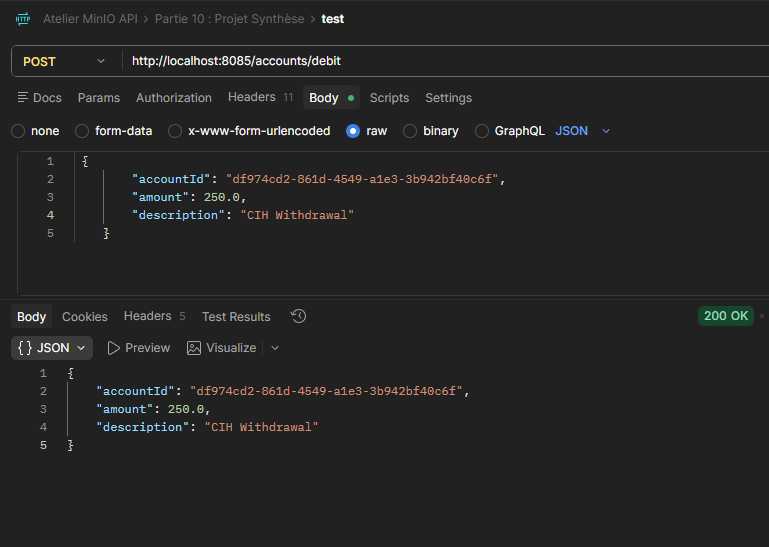

#### Account Credit (`POST /accounts/credit`)
Credits a specified amount to an account.
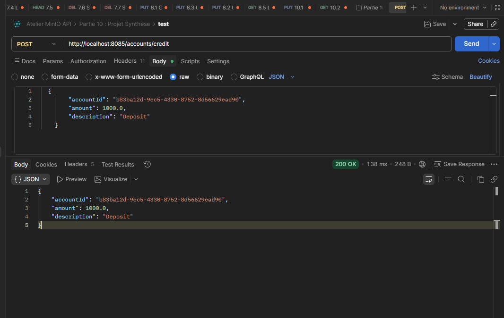

#### Transfer Between Accounts (`POST /accounts/transfer`)
Transfers an amount from a source account to a destination account.
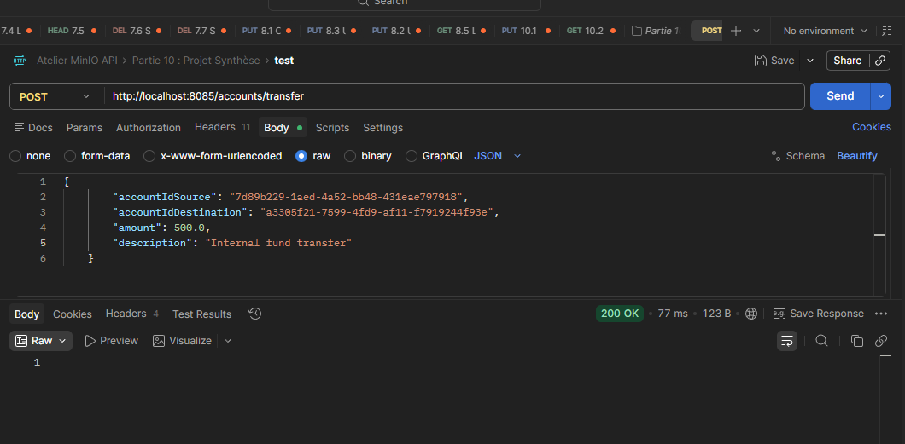

#### Paginated Account Operations History (`GET /accounts/{accountId}/pageOperations`)
Retrieves a paginated list of operations for a specific bank account.
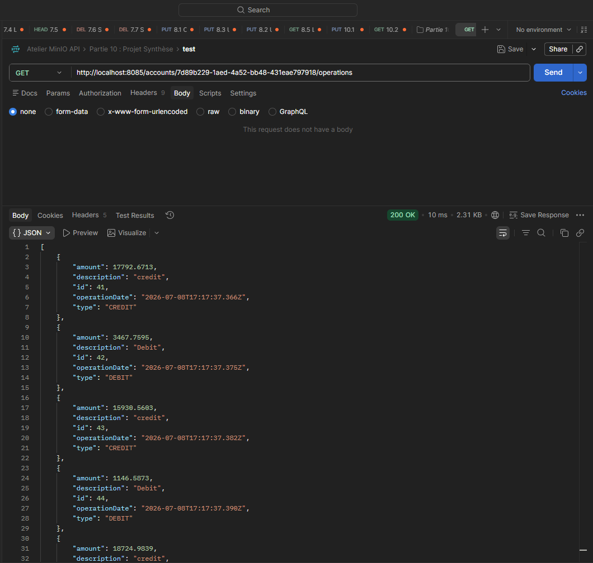

---

## Interactive API Documentation (Swagger UI)

With Springdoc OpenAPI integrated, Swagger UI is available at `http://localhost:8085/swagger-ui/index.html` to visually explore and execute all the REST endpoints.

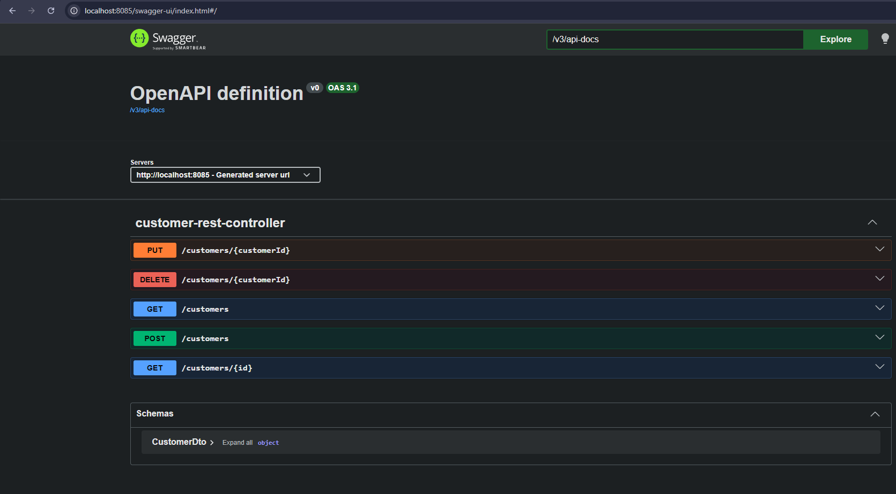
